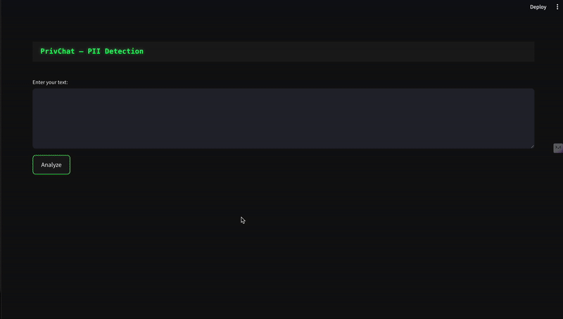

# NER and LLM Demo

## Demo


This project demonstrates the integration of Named Entity Recognition (NER) using spaCy and a Local LLM using Ollama, with a modern Streamlit frontend.

## Prerequisites

1. Python 3.8 or higher
2. Ollama installed and running locally (https://ollama.ai/)
3. The llama2 model pulled in Ollama (`ollama pull llama2`)

## Setup

1. Install the required dependencies:
```bash
pip install -r requirements.txt
```

2. Download the spaCy model:
```bash
python -m spacy download en_core_web_sm
```

## Running the Application

1. Start the FastAPI backend:
```bash
python main.py
```

2. In a new terminal, start the Streamlit frontend:
```bash
streamlit run app.py
```

3. Open your browser and navigate to the URL shown in the Streamlit output (typically http://localhost:8501)

## Features

- Named Entity Recognition using spaCy
- Local LLM integration using Ollama
- Modern Streamlit UI with:
  - Entity highlighting
  - Structured entity display
  - LLM response display
  - Real-time processing

## Usage

1. Enter your text in the input area
2. Click "Send"
3. View the detected entities and LLM response
4. See the original text with highlighted entities 